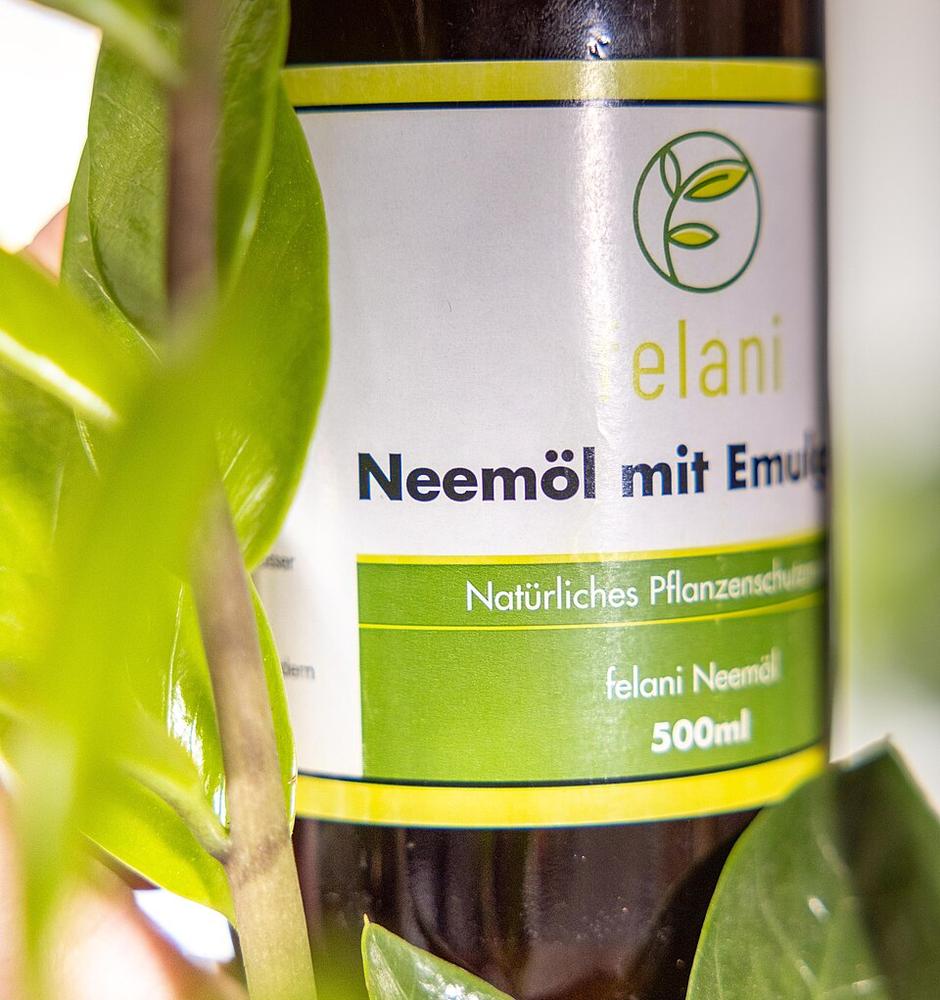
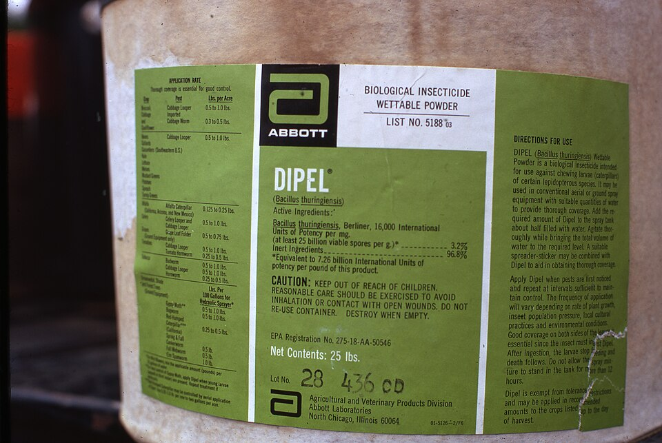
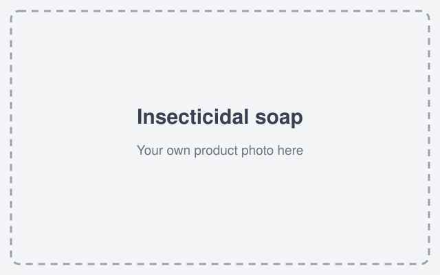
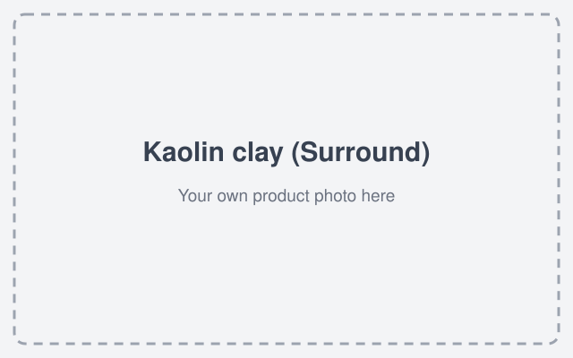
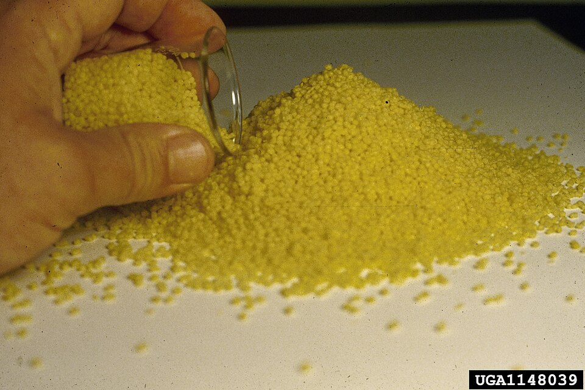
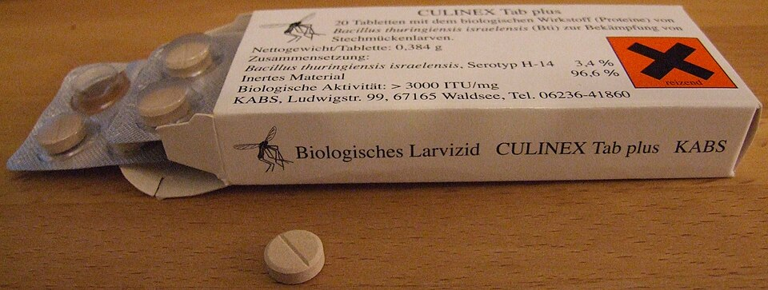
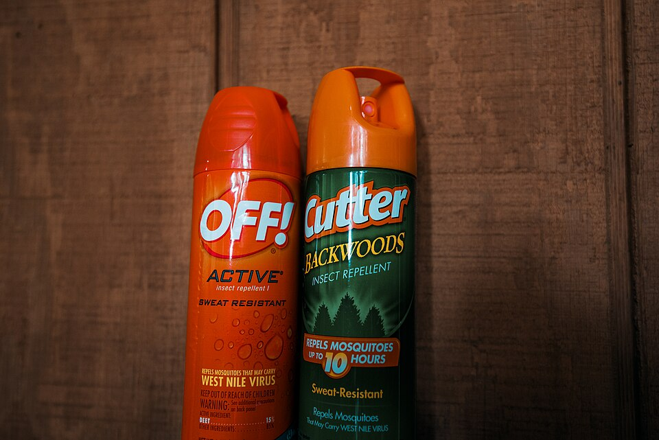
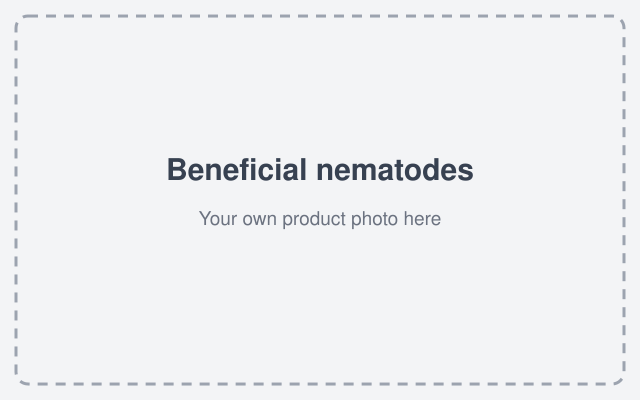
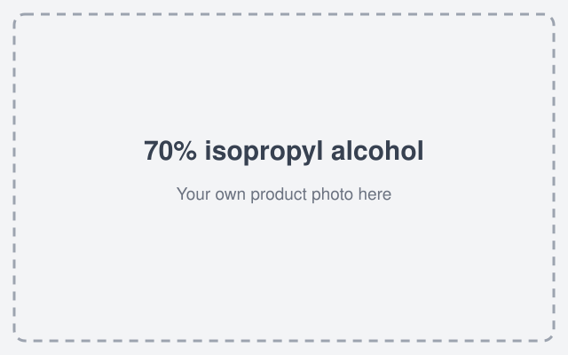

# Recommended Products (with photos)

The products this field guide recommends, one picture each. Product photos you see here are from Wikimedia Commons (credits: [images/CREDITS.md](images/CREDITS.md)). Where no free photo exists, a labeled placeholder marks the spot — take your own photo and drop it in.

| Product | What it's for | Photo |
|---|---|---|
| **Neem oil** | Soft-bodied pests — aphids, whiteflies, mites, mealybugs, scale. Evening sprays <90°F. |  |
| **Bt (Bacillus thuringiensis)** | Caterpillars — hornworms, cabbage worms, loopers, armyworms. Safe for natural enemies. |  |
| **Spinosad** | Thrips, squash bugs, cucumber beetles, flea beetles. Evening sprays, protect bees. |  |
| **Insecticidal soap** | Aphids, whiteflies, mites — must contact the bug, cover undersides, repeat. |  |
| **Horticultural oil** | Scale, mites, whiteflies, citrus psyllid (on flush). Dormant-season favorite. |  |
| **Kaolin clay (Surround)** | Flea beetles and other chewing bugs: coats leaves, they won't feed. |  |
| **Fire ant broadcast bait** | The Two-Step Method for fire ants — evening, dry, <90°F. |  |
| **Mosquito dunks / Bt israelensis** | Kill mosquito larvae in bird baths, rain barrels, any standing water you can't empty. |  |
| **DEET repellent** | The proven anti-bite layer for mosquito season (or picaridin/lemon-eucalyptus oil). |  |
| **Beneficial nematodes** | White grubs in lawns — moist soil, water in well. |  |
| **70% isopropyl alcohol** | Mealybugs on houseplants — dab each bug with a cotton swab. |  |

**Adding your own photo:** replace any placeholder — put the image in `images/products/` and update the path references. Add credit lines in [images/CREDITS.md](images/CREDITS.md).