# Houston Veggie Bug Garden

Your veggies are getting eaten. Let's figure out who's doing it and fix it — together.

This is a friendly field guide for Houston vegetable gardeners. Every bug on these pages lives here year-round (hello, humidity), and sooner or later everyone gets them. **Having bugs isn't a sign of a bad gardener — it's a sign of a garden.**

You don't need to kill everything that moves. You just need to keep the damage small enough that you still get to eat your tomatoes. That's what Integrated Pest Management (IPM) really means: *look first, act smart, spray last.*

Everything here is based on real, verified sources — Texas A&M, UC IPM, Harris County Public Health, and other university extension programs. Each bug page shows exactly where its advice comes from.

## New here? Start here

1. **Find your bug** — scroll the photos in the index below and match the damage.
2. **Read its page** — what it is, what it's doing, and how to fix it, simplest thing first.
3. **Breathe.** Most garden bugs are beatable without ever opening a spray bottle.

## Why Houston is a bug paradise

- **Bugs don't take winters off.** Our mild winters mean aphids, whiteflies, scale, and fire ants never really leave.
- **Everything reproduces fast.** In summer heat, aphids go from egg to adult in under a week.
- **Heat is an accomplice.** Stressed plants are easier prey.

So the Houston goal is **prevention + monitoring**, not a bug-free yard. A few bugs is normal — and mostly fine.

## The friendly 7-step approach

1. **Look first.** The #1 waste of spray is spraying the wrong bug. The photos below help.
2. **Pick a threshold.** A few bugs is usually fine. Act when they're actually eating your harvest.
3. **Check weekly.** Flip a leaf or two. Learn the patterns: yellow stippling = mites, tiny round holes = flea beetles.
4. **Prevent before you react.** Healthy plants, resistant varieties, clean beds, crop rotation.
5. **Try the free stuff first.** Hand-picking, hosing off, row covers, traps.
6. **Let the helpers help.** Lady beetles, lacewings, and tiny wasps eat pests for free — don't spray them away.
7. **Spray least-toxic, last.** Soap, neem, oil, Bt. And always read the label — it's the law in Texas.

## Whose bug is this? (the photo index)

Not sure who's eating your garden? Start with the picture, not the name. Each photo links to its full page — one bug per line.

[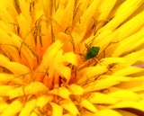](bugs/aphids.md) Curled leaves, sticky honeydew — year-round, spikes spring/fall
[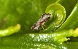](bugs/asian-citrus-psyllid.md) Vector of citrus greening (HLB) — deadly — year-round
[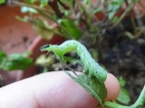](bugs/cabbage-loopers.md) Ragged holes in leaves — fall to spring
[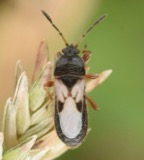](bugs/chinch-bugs.md) Straw-brown patches that spread — summer heat
[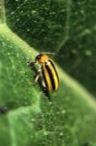](bugs/cucumber-beetles.md) Chewed leaves, bacterial wilt — spring to fall
[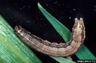](bugs/fall-armyworms.md) Lawn clipped to soil in days — Aug–Nov
[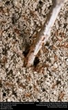](bugs/fire-ants.md) Painful stings, mound-filled yard — year-round
[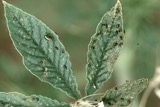](bugs/flea-beetles.md) Tiny round "shot" holes — late spring–summer
[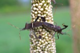](bugs/leaf-footed-bugs.md) Sunken spots on fruit — summer–fall
[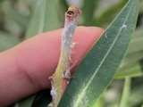](bugs/mealybugs.md) Cottony white clumps, sticky sap — year-round
[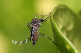](bugs/mosquitoes.md) Itchy bites, disease risk — March–Dec
[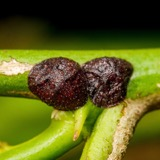](bugs/scale-insects.md) Bumps on stems, sooty mold — year-round
[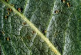](bugs/spider-mites.md) Bronze stippling, webbing — hot dry spells
[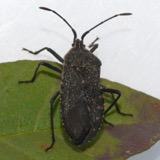](bugs/squash-bugs.md) Wilted leaves, dead vines — spring to fall
[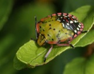](bugs/stink-bugs.md) Corky spots on fruit — year-round, peaks fall
[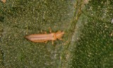](bugs/thrips.md) Silver-streaked leaves — spring spikes
[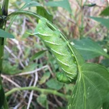](bugs/tomato-hornworms.md) Stripped branches, big droppings — summer
[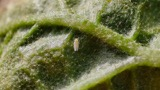](bugs/whiteflies.md) White cloud, honeydew, sooty mold — year-round
[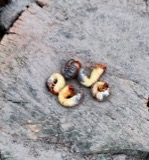](bugs/white-grubs.md) Brown turf that peels up like carpet — Aug–Sep

## Photos

- Every bug page carries a photo, and so does every recommended product — see the [product gallery](PRODUCTS.md).
- Most photos come from Wikimedia Commons under open licenses. See [image credits](images/CREDITS.md) for who made them.
- Six products still have labeled placeholder spots — no free photo exists (yet!). If you have one of these bottles, snap your own picture and drop it in.

## Want to help grow this guide?

1. Copy the template: `cp bugs/_template.md bugs/your-bug-name.md`
2. Fill it in — what it is, what it does, and how to control it in Houston.
3. Add a row to the index above.
4. Only add control methods you found in a source you've actually read (university extension pages first) and link to it.
5. Open a pull request.

Every entry answers the same three questions: **what is it, what does it do, and how do I deal with it in my Houston yard?**

## Where this information comes from

All advice is sourced from trusted university extension and public-health programs.

- Texas A&M AgriLife Extension: https://agrilifeextension.tamu.edu/
- Texas A&M Extension Entomology: https://extensionentomology.tamu.edu/
- University of California IPM: https://ipm.ucanr.edu/
- Texas A&M Fire Ant Project: https://fireant.tamu.edu/
- Harris County Mosquito Control: https://publichealth.harriscountytx.gov/About/Divisions/Mosquito-Vector-Control-Division
- Texas A&M Plant Clinic (citrus greening): https://plantclinic.tamu.edu/citrusgreening/