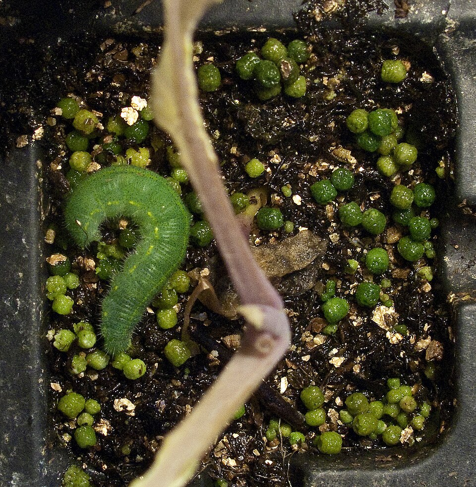

# Cabbage Loopers & Cabbageworms (Trichoplusia ni, Pieris rapae)

- **Type:** chewing
- **Houston timing:** October–May — the cool-season brassica crop
- **Severity:** medium

## Identification

*Cabbage looper larva. [Wikimedia Commons](https://commons.wikimedia.org/wiki/File:Cabbage_looper_caterpillar.jpg) — Lua Eva Blue, CC BY 3.0.*

*Imported cabbageworm on a leaf with droppings. [Wikimedia Commons](https://commons.wikimedia.org/wiki/File:Pieris_rapae_caterpillar_and_excreta.jpg) — Downtowngal, CC BY-SA 3.0.*

- Cabbage looper: light green caterpillar, smooth; moves by lifting its middle into a loop ("inchworm" style).
- Imported cabbageworm: velvety green caterpillar; the larva of the common white butterfly with black spots.

### Look-alikes
- Armyworms: ground level, don't loop.
- Diamondback moth larvae: tiny, wriggle backwards when poked.

## Host plants

Cabbage, broccoli, kale, collards, cauliflower, turnips, radish.

## Signs of damage

1. Irregular holes chewed into leaves.
2. Missing sections from the leaf edge.
3. Green-black droppings stuck in the head.

## Lifecycle in Houston

In Houston the season flips: egg to caterpillar to moth butterfly happens all cool season because winters are mild. The white butterflies you see over the bed in daytime are laying the eggs.

## Control (IPM)

### Monitor
- Scout every few days. Check undersides for eggs and small larvae (Refs: Clemson, UC IPM).

### Prevent
- Control cruciferous weeds (wild mustards) — they host the pests.
- Remove crop debris after harvest (Refs: Clemson, UC IPM).

### Physical
- Fine mesh row cover blocks egg-laying moths. Best single move.
- Hand-pick caterpillars (Refs: Clemson, UC IPM).

### Biological
- Plant small-flowered herbs (dill, cilantro, alyssum) to attract parasitic wasps.
- Avoid broad-spectrum sprays (Refs: Clemson, UC IPM).
### Least-toxic products

 *Bt products (historical Dipel label shown). [Wikimedia Commons](https://commons.wikimedia.org/wiki/File:1973._Abbott_Dipel_Bacillus_thuringiensis_(Bt)_biological_insecticide_label._Douglas-fir_tusscok_moth_control_test._(36362351863).jpg), public domain.*

- Bt is very effective on young worms and safe on natural enemies.
- Spinosad is also accepted for organic gardens (Refs: Clemson, UC IPM).

### Conventional (last resort)
- Only for heavy mixed-pest pressure; follow label (Ref: Clemson).

## Field notes (personal)

- Planted in October (the right Houston time) — Bt at dusk handled it; row cover stopped later waves.

## Sources

- Clemson HGIC 2203 (cole crops): https://hgic.clemson.edu/factsheet/cabbage-broccoli-other-cole-crop-insect-pests/
- UC IPM: Imported Cabbageworm: https://ipm.ucanr.edu/agriculture/cole-crops/imported-cabbageworm/